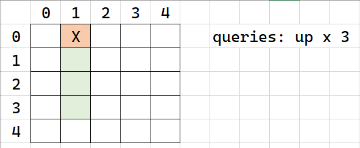
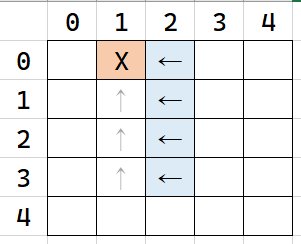
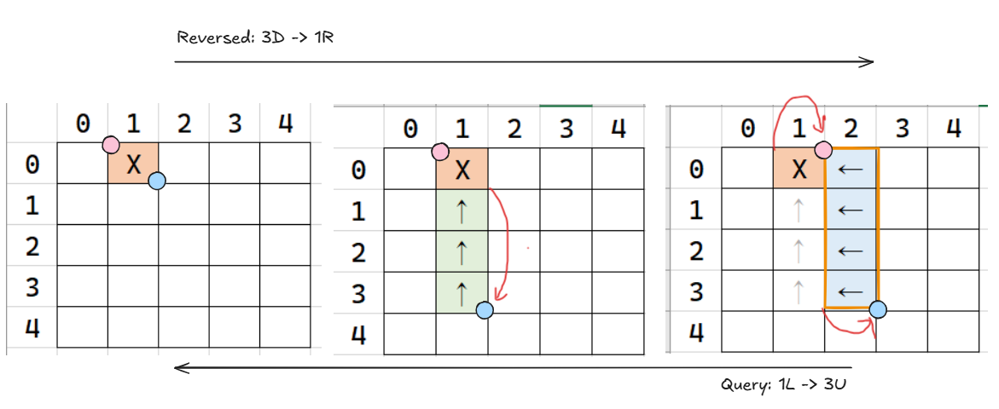

## 공 이동 시뮬레이션

문제 URL: [https://school.programmers.co.kr/learn/courses/30/lessons/87391](https://school.programmers.co.kr/learn/courses/30/lessons/87391)

문제를 보면 막막한데 일단 문제 지문 자체에서 알아낼 수 있는 내용이 있다. 격자의 모든 칸에 대해 쿼리를 전부 수행한다면 **`10^9 * 10^9 * 200,000`번의 연산을 수행해야 한다는 점이다.**

테스트해야 할 경우의 수가 너무 많으니 다른 접근법이 필요하다. 지문을 살펴보니, 도착점은 하나로 주어지고, 출발점에서 도착점으로 이동하는 방법(`queries`)가 주어진다. 여기서 **도착점에서 쿼리를 역으로 수행하여 출발점으로 이동** 하는 방법을 떠올릴 수 있다.

다만 쿼리를 역으로 수행하면서 어려운 점이 발생한다. 정답이 될 수 있는 칸들이 여러 개 있기 때문이다.

위 예시를 보자. 초록색으로 색칠된 부분이라면 위로 세 번 이동해서 0행 1열에 도착할 수 있다. (0행 1열도 가능 위치에 포함)

주어지는 쿼리가 "왼쪽 1칸 -> 위 3칸"인 경우 정답이 될 수 있는 **격자들의 범위**는 위 그림과 같다. 3행말고 0, 1, 2행도 포함되는 이유는 공 이동 시 벽에 부딪히면 제자리에 머물러야 하기 때문이다.

격자들의 범위를 구하기 위해 두 개의 변수를 사용한다. 구하고자 하는 범위의 왼쪽 상단 모서리와 오른쪽 하단 모서리 두 점을 추적하면 된다. (`row_min, row_max`와 `col_min, col_max`의 관점으로 보아도 된다.)

그림의 가운데 단계에서 분홍색 점(범위의 왼쪽 상단 모서리)를 움직이지 않은 이유는 아래로 이동하는 경우(순방향 위) 현재 0행도 정답 범위에 포함되기 때문이다. 따라서 열 방향으로 최소 위치를 표현하는 분홍색 점에 대해서, 현재 0행에 있고 아래 이동을 계산하는 경우 이동시키지 않는다. 구현 시 상하좌우 이동을 `match-case` 문으로 나누어 작성할 텐데, 매 케이스마다 비슷하게 처리하면 된다.

| 분류    | 계산 방향      | 각 점에 대해 이동하지 않는 경우 |            예외처리 = 정답 0 반환             |
| ------- | -------------- | ------------------------------- | --------------------------------------------- |
| 열 방향 | 왼쪽 이동 시   | `col_max`가 n-1열에 있는 경우   |  `col_max`가 왼쪽 밖으로 나가는 경우(0 미만)  |
|         | 오른쪽 이동 시 | `col_min`이 0열에 있는 경우     | `col_min`이 오른쪽 밖으로 나가는 경우(n 이상) |
| 행 방향 | 위로 이동 시   | `row_max`가 n-1행에 있는 경우   |  `row_max`가 위쪽 밖으로 나가는 경우(0 미만)  |
|         | 아래로 이동 시 | `row_min`이 0행에 있는 경우     | `row_min`이 아래쪽 밖으로 나가는 경우(n 이상) |

- 범위의 왼쪽 상단 모서리: `col_min`과 `row_min`으로 표시
- 범위의 오른쪽 하단 모서리: `col_max`와 `row_max`으로 표시
- 각 방향에 대해 어떤 점은 이동하지 않는 조건이 있고, 다른 점은 없다. 조건이 없는 점의 경우, 격자 밖으로 나가지 않게 이동 후의 결과를 격자 내 범위로 제한(clamp)한다. 예를 들어 왼쪽 이동 시 `col_max`는 밖으로 나가면 정답을 `0`으로 바로 반환하는 처리를 하지만, `col_min`의 경우 이동 후 격자 내에서 머물게 처리를 한다. 왼쪽으로 이동 시 격자를 왼쪽 방향으로 늘리고, 위라면 위로 늘리는데, 각각의 최소값/최댓값은 격자 내에 머물게 하고, 다른 짝의 값은 격자를 벗어나면 범위가 말이 안되는 경우가 되므로 0을 반환한다.